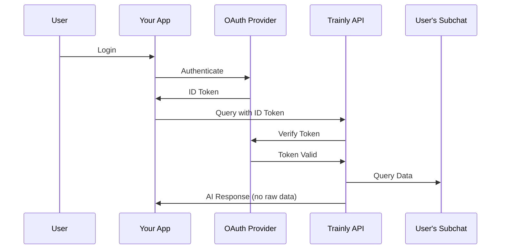

## Overview

The V1 Trusted Issuer Authentication system allows external applications to integrate with Trainly while maintaining complete user privacy. Users authenticate with their own OAuth provider (Clerk, Auth0, Google, etc.), and your application forwards the ID token to Trainly for validation.

<Info>
  **Privacy First**: With V1 auth, user files are stored in permanent private subchats that only they can access. Developers never see raw files or tokens.
</Info>

## How It Works



## Registration

### Register Your App

Before using V1 authentication, register your app with Trainly:

```bash POST /v1/console/apps/register
curl -X POST https://api.trainly.com/v1/console/apps/register \
  -H "X-Admin-Token: your_admin_token" \
  -H "Content-Type: application/x-www-form-urlencoded" \
  -d "app_name=My Application" \
  -d "issuer=https://your-oauth-provider.com" \
  -d "allowed_audiences=[\"your-audience\"]" \
  -d "alg_allowlist=[\"RS256\"]"
```

**Request Body**

<ParamField body="app_name" type="string" required>
  Name of your application
</ParamField>

<ParamField body="issuer" type="string" required>
  OAuth issuer URL (e.g., `https://accounts.google.com`)
</ParamField>

<ParamField body="allowed_audiences" type="string" required>
  JSON array of allowed audiences for JWT tokens
</ParamField>

<ParamField body="alg_allowlist" type="string">
  JSON array of allowed algorithms (default: `["RS256", "ES256"]`)
</ParamField>

<ParamField body="jwks_uri" type="string">
  Optional JWKS URI (auto-discovered if not provided)
</ParamField>

**Response**

```json
{
  "success": true,
  "app_id": "app_v1_1234567890_abc12345",
  "app_name": "My Application",
  "issuer": "https://your-oauth-provider.com",
  "allowed_audiences": ["your-audience"],
  "usage_instructions": {
    "client_flow": "User logs in with your OAuth → Client sends ID token to /v1/me/* endpoints",
    "headers_required": {
      "Authorization": "Bearer <USER_ID_TOKEN_FROM_YOUR_OAUTH>",
      "X-App-ID": "app_v1_1234567890_abc12345"
    }
  }
}
```

## User Query

### Query User's Private Chat

```bash POST /v1/me/chats/query
curl -X POST https://api.trainly.com/v1/me/chats/query \
  -H "Authorization: Bearer <USER_OAUTH_ID_TOKEN>" \
  -H "X-App-ID: app_your_app_id" \
  -H "Content-Type: application/x-www-form-urlencoded" \
  -d "messages=[{\"role\":\"user\",\"content\":\"What are the main findings?\"}]" \
  -d "response_tokens=150" \
  -d "scope_filters={}"
```

**Headers**

<ParamField header="Authorization" type="string" required>
  Bearer token with user's OAuth ID token from your provider
</ParamField>

<ParamField header="X-App-ID" type="string" required>
  Your registered app ID from Trainly
</ParamField>

**Request Body**

<ParamField body="messages" type="string" required>
  JSON string of conversation messages array. Format: `[{"role": "user", "content": "..."}]`
</ParamField>

<ParamField body="response_tokens" type="integer" default={150}>
  Maximum tokens for AI response
</ParamField>

<ParamField body="stream" type="boolean" default={false}>
  Enable streaming response
</ParamField>

<ParamField body="scope_filters" type="string" default="{}">
  JSON string of scope filters (e.g., `{"playlist_id": "xyz123"}`)
</ParamField>

**Response**

```json
{
  "success": true,
  "answer": "Based on your documents, the main findings are...",
  "chat_id": "chat_v1_abc123...",
  "user_id": "user_v1_xyz789...",
  "citations": [
    {
      "snippet": "The research shows that...",
      "score": 0.92,
      "source": "user_document"
    }
  ],
  "privacy_guarantee": {
    "user_controlled": true,
    "permanent_subchat": true,
    "developer_cannot_see_raw_files": true,
    "oauth_validated": true
  },
  "v1_auth": {
    "app_id": "app_v1_1234567890_abc12345",
    "external_user_id": "oauth_sub...",
    "issuer": "https://accounts.google.com"
  }
}
```

## File Upload

### Upload File to User's Private Chat

Users can upload files directly to their permanent private subchat:

```bash POST /v1/me/chats/files/upload
curl -X POST https://api.trainly.com/v1/me/chats/files/upload \
  -H "Authorization: Bearer <USER_OAUTH_ID_TOKEN>" \
  -H "X-App-ID: app_your_app_id" \
  -F "file=@document.pdf" \
  -F "scope_values={\"playlist_id\":\"playlist_123\"}"
```

**Alternative: Text Upload**

```bash
curl -X POST https://api.trainly.com/v1/me/chats/files/upload \
  -H "Authorization: Bearer <USER_OAUTH_ID_TOKEN>" \
  -H "X-App-ID: app_your_app_id" \
  -F "text_content=This is my document content..." \
  -F "content_name=My Document.txt" \
  -F "scope_values={}"
```

**Headers**

<ParamField header="Authorization" type="string" required>
  Bearer token with user's OAuth ID token
</ParamField>

<ParamField header="X-App-ID" type="string" required>
  Your registered app ID
</ParamField>

**Request Body (Multipart Form)**

<ParamField body="file" type="file">
  File to upload (PDF, DOCX, TXT, etc.) - max 5MB
</ParamField>

<ParamField body="text_content" type="string">
  Alternative to file upload - raw text content
</ParamField>

<ParamField body="content_name" type="string">
  Required with text_content - name for the content
</ParamField>

<ParamField body="scope_values" type="string" default="{}">
  JSON string of custom scope values (e.g., `{"playlist_id": "xyz"}`)
</ParamField>

**Response**

```json
{
  "success": true,
  "filename": "document.pdf",
  "file_id": "v1_user_v1_xyz789_document.pdf_1609459200",
  "chat_id": "chat_v1_abc123...",
  "user_id": "user_v1_xyz789...",
  "size_bytes": 524288,
  "processing_status": "completed",
  "privacy_guarantee": {
    "permanent_storage": true,
    "user_private_subchat": true,
    "developer_cannot_access": true,
    "oauth_validated": true
  },
  "message": "File uploaded and processed in your permanent private subchat"
}
```

### Bulk File Upload

Upload multiple files at once:

```bash POST /v1/me/chats/files/upload-bulk
curl -X POST https://api.trainly.com/v1/me/chats/files/upload-bulk \
  -H "Authorization: Bearer <USER_OAUTH_ID_TOKEN>" \
  -H "X-App-ID: app_your_app_id" \
  -F "files=@document1.pdf" \
  -F "files=@document2.pdf" \
  -F "files=@document3.txt" \
  -F "scope_values={\"workspace_id\":\"ws_123\"}"
```

**Response**

```json
{
  "success": true,
  "total_files": 3,
  "successful_uploads": 3,
  "failed_uploads": 0,
  "total_size_bytes": 1572864,
  "chat_id": "chat_v1_abc123...",
  "user_id": "user_v1_xyz789...",
  "results": [
    {
      "filename": "document1.pdf",
      "success": true,
      "file_id": "v1_user_...",
      "size_bytes": 524288,
      "processing_status": "completed"
    }
  ],
  "message": "Bulk upload completed: 3/3 files processed successfully"
}
```

## File Management

### List User's Files

```bash GET /v1/me/chats/files
curl -X GET https://api.trainly.com/v1/me/chats/files \
  -H "Authorization: Bearer <USER_OAUTH_ID_TOKEN>" \
  -H "X-App-ID: app_your_app_id"
```

**Response**

```json
{
  "success": true,
  "files": [
    {
      "file_id": "v1_user_xyz_document.pdf_1609459200",
      "filename": "document.pdf",
      "upload_date": "2024-01-01T12:00:00Z",
      "size_bytes": 524288,
      "chunk_count": 42
    }
  ],
  "total_files": 1,
  "total_size_bytes": 524288
}
```

### Delete User's File

```bash DELETE /v1/me/chats/files/{file_id}
curl -X DELETE https://api.trainly.com/v1/me/chats/files/v1_user_xyz_document.pdf_1609459200 \
  -H "Authorization: Bearer <USER_OAUTH_ID_TOKEN>" \
  -H "X-App-ID: app_your_app_id"
```

**Response**

```json
{
  "success": true,
  "message": "File 'document.pdf' deleted successfully",
  "file_id": "v1_user_xyz_document.pdf_1609459200",
  "filename": "document.pdf",
  "chunks_deleted": 42,
  "size_bytes_freed": 524288
}
```

## User Profile

### Get User Profile

```bash GET /v1/me/profile
curl -X GET https://api.trainly.com/v1/me/profile \
  -H "Authorization: Bearer <USER_OAUTH_ID_TOKEN>" \
  -H "X-App-ID: app_your_app_id"
```

**Response**

```json
{
  "success": true,
  "user_id": "user_v1_abc123...",
  "external_user_id": "oauth_sub...",
  "chat_id": "chat_v1_xyz789...",
  "app_id": "app_v1_1234567890_abc12345",
  "issuer": "https://accounts.google.com",
  "subchat_created": false,
  "privacy_info": {
    "oauth_provider": "https://accounts.google.com",
    "permanent_subchat": true,
    "data_isolation": "Complete - only you can access your files and queries",
    "developer_access": "AI responses only - cannot see raw files or queries"
  }
}
```

## Supported OAuth Providers

Trainly works with any OAuth 2.0 / OpenID Connect provider:

<CardGroup cols={2}>
  <Card title="Clerk" icon="user-shield">
    Modern authentication for web apps
  </Card>
  <Card title="Auth0" icon="lock">
    Enterprise-grade identity platform
  </Card>
  <Card title="Google" icon="google">
    Google OAuth 2.0
  </Card>
  <Card title="Microsoft" icon="microsoft">
    Microsoft Identity Platform
  </Card>
  <Card title="Okta" icon="building">
    Enterprise identity management
  </Card>
  <Card title="Custom" icon="code">
    Any OpenID Connect provider
  </Card>
</CardGroup>

## Security Best Practices

<Warning>
  **Never store user OAuth ID tokens on your servers**. They should only exist in the user's browser/device and be sent directly to Trainly's API.
</Warning>

### Token Flow Best Practices

1. **User Login**: User authenticates with your OAuth provider
2. **Get ID Token**: Your frontend receives the ID token
3. **Direct API Calls**: Frontend makes API calls directly to Trainly with the ID token
4. **No Backend Storage**: Never send ID tokens to your backend

### Example Implementation (React)

```jsx
import { useAuth } from '@clerk/clerk-react';

function QueryComponent() {
  const { getToken } = useAuth();

  async function queryTrainly(question) {
    const idToken = await getToken({ template: 'trainly' });

    const response = await fetch('https://api.trainly.com/v1/me/chats/query', {
      method: 'POST',
      headers: {
        'Authorization': `Bearer ${idToken}`,
        'X-App-ID': 'your_app_id',
        'Content-Type': 'application/x-www-form-urlencoded'
      },
      body: new URLSearchParams({
        messages: JSON.stringify([
          { role: 'user', content: question }
        ])
      })
    });

    return await response.json();
  }

  // ... rest of component
}
```

## Dynamic Configuration

Trainly can automatically discover OAuth configuration:

- **Issuer Detection**: Automatically extracts issuer from JWT tokens
- **JWKS Discovery**: Auto-discovers JWKS URI from `.well-known/openid-configuration`
- **Audience Handling**: Supports both single and multiple audiences

This means you can use `DYNAMIC` for both issuer and audience during app registration, and Trainly will adapt to the actual tokens received.

## Error Handling

<ResponseField name="401 Unauthorized" type="error">
  Invalid or expired OAuth token
  ```json
  {
    "detail": "Token has expired"
  }
  ```
</ResponseField>

<ResponseField name="403 Forbidden" type="error">
  App API access disabled
  ```json
  {
    "detail": "API access is disabled for this app. Please contact the app developer to enable API access."
  }
  ```
</ResponseField>

<ResponseField name="404 Not Found" type="error">
  App not found in registry
  ```json
  {
    "detail": "App app_xyz not found in V1 registry or Convex system"
  }
  ```
</ResponseField>

## Rate Limits

V1 authentication endpoints have the following rate limits:

- **Query Endpoints**: 60 requests/minute per user
- **File Upload**: 30 requests/minute per user
- **Bulk Upload**: 10 requests/minute per user

Rate limit headers are included in responses:

```
X-RateLimit-Limit: 60
X-RateLimit-Remaining: 59
X-RateLimit-Reset: 1609459200
```

