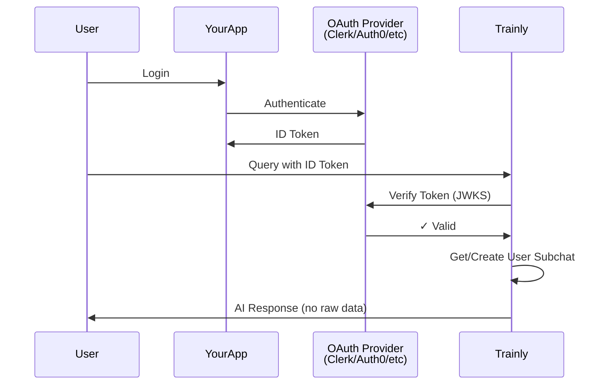

## Overview

Trainly supports multiple authentication methods to suit different use cases, from simple API keys to advanced OAuth flows with complete user privacy.

<CardGroup cols={3}>
  <Card title="API Keys" icon="key">
    Simple authentication for trusted environments
  </Card>
  <Card title="V1 OAuth" icon="shield-check">
    User-controlled authentication with complete privacy
  </Card>
  <Card title="Privacy OAuth" icon="lock">
    Legacy OAuth with strict privacy controls
  </Card>
</CardGroup>

## API Key Authentication

### Overview

API keys provide simple authentication for server-to-server communication or trusted environments.

<Info>
  API keys are scoped to specific chats and can be enabled/disabled in chat
  settings.
</Info>

### Getting Your API Key

<Steps>
  <Step title="Create a Chat">Create a new chat and upload documents</Step>
  <Step title="Enable API Access">Go to Settings → API Access → Enable</Step>
  <Step title="Publish Settings">
    Publish your chat settings (required for API access)
  </Step>
  <Step title="Generate Key">Click "Generate API Key" to create a new key</Step>
  <Step title="Copy & Store">
    Copy the key (starts with `tk_`) and store it securely
  </Step>
</Steps>

### Using API Keys

<CodeGroup>

```bash cURL
curl -X POST https://api.trainlyai.com/v1/chat_abc123/answer_question \
  -H "Authorization: Bearer tk_your_api_key" \
  -H "Content-Type: application/json" \
  -d '{"question": "What are the findings?"}'
```

```javascript JavaScript
import { TrainlyClient } from "@trainly/react";

const trainly = new TrainlyClient({
  apiKey: process.env.TRAINLY_API_KEY, // tk_...
  chatId: "chat_abc123",
});

const response = await trainly.query({
  question: "What are the findings?",
});
```

```python Python
from trainly import TrainlyClient
import os

trainly = TrainlyClient(
    api_key=os.getenv("TRAINLY_API_KEY"),
    chat_id="chat_abc123"
)

response = trainly.query(
    question="What are the findings?"
)
```

</CodeGroup>

### API Key Security

<Warning>
  **Security Best Practices**: - Never commit API keys to source control - Use
  environment variables - Rotate keys regularly - Revoke unused keys - Use
  different keys for different environments
</Warning>

```bash
# .env (add to .gitignore!)
TRAINLY_API_KEY=tk_your_api_key
TRAINLY_CHAT_ID=chat_abc123

# Development
TRAINLY_DEV_API_KEY=tk_dev_key
TRAINLY_DEV_CHAT_ID=chat_dev_123

# Production
TRAINLY_PROD_API_KEY=tk_prod_key
TRAINLY_PROD_CHAT_ID=chat_prod_123
```

## V1 Trusted Issuer Authentication

### Overview

V1 authentication enables external applications to integrate with Trainly while maintaining complete user privacy. Users authenticate with their own OAuth provider, and your app forwards the ID token to Trainly.

<Info>
  **Privacy First**: Users control their data. Developers never see raw files or
  OAuth tokens.
</Info>

### How It Works



### Setup

#### Step 1: Register Your App

If using Convex-based apps (automatic):

- Create an app in Trainly dashboard
- App is automatically registered
- Dynamic OAuth detection enabled

Manual registration (optional):

```bash
curl -X POST https://api.trainlyai.com/v1/console/apps/register \
  -H "X-Admin-Token: your_admin_token" \
  -d "app_name=My Application" \
  -d "issuer=DYNAMIC" \
  -d "allowed_audiences=[\"DYNAMIC\"]"
```

**Response:**

```json
{
  "app_id": "app_v1_1234567890_abc",
  "message": "App registered for V1 Trusted Issuer authentication"
}
```

#### Step 2: Configure OAuth Provider

<Tabs>
  <Tab title="Clerk">
    ```javascript
    // app/layout.tsx
    import { ClerkProvider } from '@clerk/nextjs';

    export default function RootLayout({ children }) {
      return (
        <ClerkProvider>
          <html lang="en">
            <body>{children}</body>
          </html>
        </ClerkProvider>
      );
    }
    ```

    ```javascript
    // Get user token
    import { useAuth } from '@clerk/nextjs';

    function MyComponent() {
      const { getToken } = useAuth();

      async function queryTrainly(question: string) {
        // Get user's ID token
        const token = await getToken();

        // Call Trainly with user's token
        const response = await fetch(
          'https://api.trainlyai.com/v1/me/chats/query',
          {
            method: 'POST',
            headers: {
              'Authorization': `Bearer ${token}`,
              'X-App-ID': 'app_your_app_id'
            },
            body: new URLSearchParams({
              messages: JSON.stringify([
                { role: 'user', content: question }
              ])
            })
          }
        );

        return await response.json();
      }
    }
    ```

  </Tab>

  <Tab title="Auth0">
    ```javascript
    // App.tsx
    import { Auth0Provider, useAuth0 } from '@auth0/auth0-react';

    function App() {
      return (
        <Auth0Provider
          domain="your-domain.auth0.com"
          clientId="your-client-id"
          redirectUri={window.location.origin}
        >
          <MyApp />
        </Auth0Provider>
      );
    }

    function MyApp() {
      const { getAccessTokenSilently } = useAuth0();

      async function queryTrainly(question: string) {
        // Get user's token
        const token = await getAccessTokenSilently();

        const response = await fetch(
          'https://api.trainlyai.com/v1/me/chats/query',
          {
            method: 'POST',
            headers: {
              'Authorization': `Bearer ${token}`,
              'X-App-ID': 'app_your_app_id'
            },
            body: new URLSearchParams({
              messages: JSON.stringify([
                { role: 'user', content: question }
              ])
            })
          }
        );

        return await response.json();
      }
    }
    ```

  </Tab>

  <Tab title="Firebase">
    ```javascript
    // firebaseConfig.ts
    import { initializeApp } from 'firebase/app';
    import { getAuth } from 'firebase/auth';

    const app = initializeApp({
      apiKey: "your-api-key",
      authDomain: "your-app.firebaseapp.com",
      projectId: "your-project"
    });

    export const auth = getAuth(app);

    // Get user token
    import { auth } from './firebaseConfig';

    async function queryTrainly(question: string) {
      const user = auth.currentUser;

      if (!user) {
        throw new Error('User not authenticated');
      }

      // Get ID token
      const token = await user.getIdToken();

      const response = await fetch(
        'https://api.trainlyai.com/v1/me/chats/query',
        {
          method: 'POST',
          headers: {
            'Authorization': `Bearer ${token}`,
            'X-App-ID': 'app_your_app_id'
          },
          body: new URLSearchParams({
            messages: JSON.stringify([
              { role: 'user', content: question }
            ])
          })
        }
      );

      return await response.json();
    }
    ```

  </Tab>
</Tabs>

#### Step 3: Make API Calls

```typescript
// Query user's private data
async function queryUserData(userToken: string, question: string) {
  const response = await fetch("https://api.trainlyai.com/v1/me/chats/query", {
    method: "POST",
    headers: {
      Authorization: `Bearer ${userToken}`, // User's OAuth token
      "X-App-ID": "app_your_app_id",
      "Content-Type": "application/x-www-form-urlencoded",
    },
    body: new URLSearchParams({
      messages: JSON.stringify([{ role: "user", content: question }]),
      response_tokens: "150",
    }),
  });

  return await response.json();
}
```

### V1 Features

<AccordionGroup>
  <Accordion title="Permanent Private Subchats">
    Each user gets a permanent private subchat:

    - **Deterministic**: Same user always gets same subchat
    - **Isolated**: Users cannot access each other's data
    - **Persistent**: Data persists across sessions
    - **Private**: Developers cannot see raw files

  </Accordion>

  <Accordion title="Dynamic OAuth Detection">
    Trainly automatically detects OAuth configuration:

    - **Issuer Discovery**: Extracts from JWT token
    - **JWKS Auto-Discovery**: Fetches from `.well-known/openid-configuration`
    - **Multi-Provider**: Works with any OAuth 2.0 / OpenID Connect provider

  </Accordion>

  <Accordion title="Privacy Guarantees">
    Complete user data privacy:

    - Files stored in user's private subchat
    - Developers get AI responses only, no raw data
    - Citations filtered for privacy
    - OAuth tokens never stored by Trainly

  </Accordion>
</AccordionGroup>

### Complete V1 Example

```typescript
// lib/trainly-v1.ts
import { useAuth } from '@clerk/nextjs';

export function useTrainlyV1() {
  const { getToken } = useAuth();

  async function query(question: string) {
    const token = await getToken();

    const response = await fetch(
      'https://api.trainlyai.com/v1/me/chats/query',
      {
        method: 'POST',
        headers: {
          'Authorization': `Bearer ${token}`,
          'X-App-ID': process.env.NEXT_PUBLIC_TRAINLY_APP_ID!
        },
        body: new URLSearchParams({
          messages: JSON.stringify([
            { role: 'user', content: question }
          ])
        })
      }
    );

    if (!response.ok) {
      throw new Error(`Query failed: ${response.status}`);
    }

    return await response.json();
  }

  async function uploadFile(file: File, scopeValues?: Record<string, any>) {
    const token = await getToken();

    const formData = new FormData();
    formData.append('file', file);
    formData.append('scope_values', JSON.stringify(scopeValues || {}));

    const response = await fetch(
      'https://api.trainlyai.com/v1/me/chats/files/upload',
      {
        method: 'POST',
        headers: {
          'Authorization': `Bearer ${token}`,
          'X-App-ID': process.env.NEXT_PUBLIC_TRAINLY_APP_ID!
        },
        body: formData
      }
    );

    return await response.json();
  }

  async function listFiles() {
    const token = await getToken();

    const response = await fetch(
      'https://api.trainlyai.com/v1/me/chats/files',
      {
        headers: {
          'Authorization': `Bearer ${token}`,
          'X-App-ID': process.env.NEXT_PUBLIC_TRAINLY_APP_ID!
        }
      }
    );

    return await response.json();
  }

  return { query, uploadFile, listFiles };
}

// Usage in component
function DocumentChat() {
  const trainly = useTrainlyV1();
  const [answer, setAnswer] = useState('');

  async function handleQuery(question: string) {
    const result = await trainly.query(question);
    setAnswer(result.answer);
  }

  return (
    <div>
      {/* Your UI */}
    </div>
  );
}
```

## Privacy-First OAuth (Legacy)

### Two-Step OAuth Flow

<Steps>
  <Step title="User Authorization">
    User visits authorization URL and grants permission
  </Step>
  <Step title="Authorization Code">
    User redirected back with authorization code
  </Step>
  <Step title="Token Exchange">Exchange code for access token</Step>
  <Step title="API Access">Use access token for API calls</Step>
</Steps>

### Implementation

```javascript
// Step 1: Get authorization URL
async function startOAuthFlow(userId: string) {
  const response = await fetch(
    'https://api.trainlyai.com/v1/oauth/authorize',
    {
      method: 'POST',
      headers: {
        'Content-Type': 'application/x-www-form-urlencoded',
        'X-API-Key': 'your_app_secret'
      },
      body: new URLSearchParams({
        end_user_id: userId,
        capabilities: JSON.stringify(['ask', 'upload']),
        redirect_uri: 'https://yourapp.com/oauth/callback'
      })
    }
  );

  const data = await response.json();

  // Redirect user to authorization URL
  window.location.href = data.authorization_url;
}

// Step 2: Handle callback
async function handleOAuthCallback(code: string) {
  const response = await fetch(
    'https://api.trainlyai.com/v1/oauth/token',
    {
      method: 'POST',
      headers: {
        'Content-Type': 'application/x-www-form-urlencoded'
      },
      body: new URLSearchParams({
        grant_type: 'authorization_code',
        code: code,
        redirect_uri: 'https://yourapp.com/oauth/callback'
      })
    }
  );

  const data = await response.json();

  // Store user's token securely (on user's device only!)
  localStorage.setItem('trainly_user_token', data.access_token);

  return data;
}

// Step 3: Use token for queries
async function queryWithUserToken(question: string) {
  const userToken = localStorage.getItem('trainly_user_token');

  const response = await fetch(
    'https://api.trainlyai.com/v1/privacy/query',
    {
      method: 'POST',
      headers: {
        'X-Scoped-Token': userToken,
        'Content-Type': 'application/json'
      },
      body: JSON.stringify({
        end_user_id: userId,
        question: question
      })
    }
  );

  return await response.json();
}
```

## App Secret Authentication

### Server-to-Server Authentication

For backend services that need to provision users or manage resources:

```javascript
// Provision a new user
async function provisionUser(endUserId: string, capabilities: string[]) {
  const response = await fetch(
    'https://api.trainlyai.com/v1/privacy/apps/users/provision',
    {
      method: 'POST',
      headers: {
        'Authorization': `Bearer ${process.env.TRAINLY_APP_SECRET}`, // as_...
        'Content-Type': 'application/json'
      },
      body: JSON.stringify({
        end_user_id: endUserId,
        capabilities: capabilities
      })
    }
  );

  const data = await response.json();

  return {
    userId: data.end_user_id,
    scopedToken: data.scoped_token,
    capabilities: data.capabilities
  };
}

// Usage
const userData = await provisionUser('user_123', ['ask', 'upload']);

// Store scopedToken on user's device (not your servers!)
```

<Warning>
  App secrets are powerful: - Can create users and mint tokens - **Cannot** read
  raw user data - Should only be used server-side - Keep them as secure as
  database passwords
</Warning>

## Multi-Tenant Authentication

### Tenant Isolation

```typescript
// lib/tenant-auth.ts
interface TenantContext {
  tenantId: string;
  userId: string;
  role: "admin" | "member" | "viewer";
}

class TenantAuthService {
  private trainly: TrainlyClient;

  constructor() {
    this.trainly = new TrainlyClient({
      apiKey: process.env.TRAINLY_API_KEY!,
      chatId: process.env.TRAINLY_CHAT_ID!,
    });
  }

  async query(question: string, context: TenantContext) {
    // Enforce tenant isolation via scope filters
    return await this.trainly.query({
      question,
      scopeFilters: {
        tenant_id: context.tenantId,
        // Optional: filter by role
        ...(context.role !== "admin" && {
          access_level: "public",
        }),
      },
    });
  }

  async uploadDocument(
    file: File,
    context: TenantContext,
    metadata: Record<string, any>,
  ) {
    // Check permissions
    if (context.role === "viewer") {
      throw new Error("Viewers cannot upload documents");
    }

    return await this.trainly.uploadFile({
      file,
      scopeValues: {
        tenant_id: context.tenantId,
        uploaded_by: context.userId,
        upload_role: context.role,
        ...metadata,
      },
    });
  }
}

// Middleware to extract tenant context
app.use(async (req, res, next) => {
  const user = await getCurrentUser(req);

  if (!user) {
    return res.status(401).json({ error: "Unauthorized" });
  }

  req.tenantContext = {
    tenantId: user.tenantId,
    userId: user.id,
    role: user.role,
  };

  next();
});

// API endpoint with tenant isolation
app.post("/api/query", async (req, res) => {
  const auth = new TenantAuthService();

  const response = await auth.query(req.body.question, req.tenantContext);

  res.json(response);
});
```

## Token Management

### Token Storage

<Tabs>
  <Tab title="Browser (Secure)">
    ```typescript
    // Store in httpOnly cookie (most secure)
    // Set via server
    res.cookie('trainly_token', token, {
      httpOnly: true,
      secure: true,
      sameSite: 'strict',
      maxAge: 3600000 // 1 hour
    });

    // Or use secure localStorage wrapper
    class SecureStorage {
      private static key = 'trainly_token';

      static setToken(token: string) {
        // Encrypt before storing
        const encrypted = encrypt(token);
        localStorage.setItem(this.key, encrypted);
      }

      static getToken(): string | null {
        const encrypted = localStorage.getItem(this.key);
        if (!encrypted) return null;
        return decrypt(encrypted);
      }

      static clearToken() {
        localStorage.removeItem(this.key);
      }
    }
    ```

  </Tab>

  <Tab title="Mobile (Secure)">
    ```typescript
    // React Native with Secure Storage
    import * as SecureStore from 'expo-secure-store';

    export class TokenManager {
      private static KEY = 'trainly_token';

      static async saveToken(token: string) {
        await SecureStore.setItemAsync(this.KEY, token);
      }

      static async getToken(): Promise<string | null> {
        return await SecureStore.getItemAsync(this.KEY);
      }

      static async deleteToken() {
        await SecureStore.deleteItemAsync(this.KEY);
      }
    }

    // Usage
    await TokenManager.saveToken(userToken);
    const token = await TokenManager.getToken();
    ```

  </Tab>

  <Tab title="Server (Environment)">
    ```python
    # Server-side token storage
    import os
    from typing import Optional

    class TokenManager:
        @staticmethod
        def get_api_key() -> str:
            """Get API key from environment"""
            api_key = os.getenv("TRAINLY_API_KEY")

            if not api_key:
                raise ValueError("TRAINLY_API_KEY not set")

            if not api_key.startswith("tk_"):
                raise ValueError("Invalid API key format")

            return api_key

        @staticmethod
        def get_app_secret() -> Optional[str]:
            """Get app secret if configured"""
            return os.getenv("TRAINLY_APP_SECRET")

    # Usage
    api_key = TokenManager.get_api_key()
    trainly = TrainlyClient(api_key=api_key, chat_id=chat_id)
    ```

  </Tab>
</Tabs>

### Token Rotation

```typescript
class TokenRotationService {
  private token: string;
  private expiresAt: Date;

  constructor(private getNewToken: () => Promise<string>) {}

  async getValidToken(): Promise<string> {
    // Check if token is expired or about to expire
    if (!this.token || this.isExpiringSoon()) {
      this.token = await this.getNewToken();
      this.expiresAt = this.calculateExpiry();
    }

    return this.token;
  }

  private isExpiringSoon(): boolean {
    if (!this.expiresAt) return true;

    const now = new Date();
    const fiveMinutesFromNow = new Date(now.getTime() + 5 * 60000);

    return this.expiresAt < fiveMinutesFromNow;
  }

  private calculateExpiry(): Date {
    // Tokens typically expire in 1 hour
    return new Date(Date.now() + 3600000);
  }
}

// Usage
const tokenService = new TokenRotationService(async () => {
  const { getToken } = useAuth();
  return await getToken();
});

async function queryWithRotation(question: string) {
  const token = await tokenService.getValidToken();

  return await fetch("https://api.trainlyai.com/v1/me/chats/query", {
    headers: {
      Authorization: `Bearer ${token}`,
      "X-App-ID": appId,
    },
    // ... rest of request
  });
}
```

## Security Checklist

<Steps>
  <Step title="API Key Security">
    - ✅ Store in environment variables
    - ✅ Never commit to source control
    - ✅ Rotate keys regularly
    - ✅ Use different keys per environment
    - ✅ Revoke unused keys immediately
  </Step>

<Step title="Token Management">
  - ✅ Use httpOnly cookies when possible - ✅ Implement token rotation - ✅ Set
  appropriate expiry times - ✅ Clear tokens on logout - ✅ Validate tokens
  server-side
</Step>

<Step title="Input Validation">
  - ✅ Validate all user input - ✅ Sanitize for XSS - ✅ Check length limits -
  ✅ Validate file types - ✅ Scan uploaded files
</Step>

<Step title="Network Security">
  - ✅ Use HTTPS only - ✅ Implement rate limiting - ✅ Add request timeouts -
  ✅ Validate CORS origins - ✅ Use secure headers
</Step>

  <Step title="Access Control">
    - ✅ Verify user permissions
    - ✅ Implement tenant isolation
    - ✅ Log all access attempts
    - ✅ Monitor for anomalies
    - ✅ Implement audit trails
  </Step>
</Steps>

## Authentication Flow Examples

### Next.js with Clerk (Recommended)

Complete auth flow for Next.js app:

```typescript
// middleware.ts
import { authMiddleware } from "@clerk/nextjs";

export default authMiddleware({
  publicRoutes: ["/api/health"],
});

export const config = {
  matcher: ["/((?!.*\\..*|_next).*)", "/", "/(api|trpc)(.*)"],
};
```

```typescript
// app/api/v1/query/route.ts
import { auth } from "@clerk/nextjs";
import { NextRequest, NextResponse } from "next/server";

export async function POST(request: NextRequest) {
  // Get user's auth token
  const { getToken } = auth();
  const token = await getToken();

  if (!token) {
    return NextResponse.json({ error: "Unauthorized" }, { status: 401 });
  }

  const { question } = await request.json();

  // Call Trainly V1 API with user's token
  const response = await fetch("https://api.trainlyai.com/v1/me/chats/query", {
    method: "POST",
    headers: {
      Authorization: `Bearer ${token}`,
      "X-App-ID": process.env.TRAINLY_APP_ID!,
    },
    body: new URLSearchParams({
      messages: JSON.stringify([{ role: "user", content: question }]),
    }),
  });

  return NextResponse.json(await response.json());
}
```

### Express with Passport

```javascript
const express = require("express");
const passport = require("passport");
const { Strategy: JwtStrategy, ExtractJwt } = require("passport-jwt");

const app = express();

// Configure passport
passport.use(
  new JwtStrategy(
    {
      jwtFromRequest: ExtractJwt.fromAuthHeaderAsBearerToken(),
      secretOrKey: process.env.JWT_SECRET,
    },
    (payload, done) => {
      return done(null, payload);
    },
  ),
);

// Protected route
app.post(
  "/api/query",
  passport.authenticate("jwt", { session: false }),
  async (req, res) => {
    try {
      const { question } = req.body;
      const userId = req.user.id;

      // Query with user context
      const response = await trainly.query({
        question,
        scopeFilters: {
          user_id: userId,
        },
      });

      res.json(response);
    } catch (error) {
      res.status(500).json({ error: error.message });
    }
  },
);
```

## Next Steps

<CardGroup cols={2}>
  <Card
    title="V1 Authentication"
    icon="shield-check"
    href="/api-reference/v1-authentication"
  >
    Detailed V1 OAuth documentation
  </Card>
  <Card title="Security Guide" icon="lock" href="/security-guide">
    Advanced security practices
  </Card>
  <Card title="API Reference" icon="book" href="/api-reference/introduction">
    Complete API documentation
  </Card>
  <Card title="Examples" icon="code" href="/integration-examples">
    Real-world integration examples
  </Card>
</CardGroup>
