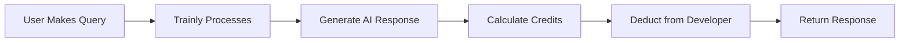

## Overview

Trainly uses a credit-based system for API usage. Credits are consumed based on the AI model used and the number of tokens processed.

<Info>
  1 credit = 1,000 tokens with GPT-4o-mini (baseline model)
</Info>

## How Credits Work

### Credit Calculation

Credits are calculated based on actual token usage:

```
credits = (tokens / 1000) × model_multiplier
```

**Example:**
- Question: 50 tokens
- Answer: 200 tokens
- Total: 250 tokens
- Model: GPT-4o-mini (1x multiplier)
- Credits used: (250 / 1000) × 1 = **0.25 credits**

### Token Estimation

Tokens are roughly estimated as:

```
tokens ≈ characters / 4
```

**Example:**
- Question: "What are the main findings?" (28 chars) ≈ 7 tokens
- Answer: 800 characters ≈ 200 tokens
- Total: ~207 tokens ≈ **0.21 credits**

<Note>
  Trainly calculates credits based on actual usage, not estimates. You only pay for what you use!
</Note>

## Model Pricing

### OpenAI Models

<CardGroup cols={2}>
  <Card title="GPT-4o-mini" icon="bolt">
    **1x multiplier** (Baseline)
    - Fastest and most cost-effective
    - Great for most use cases
    - Recommended for production
  </Card>

  <Card title="GPT-3.5-turbo" icon="gauge">
    **0.7x multiplier** (30% cheaper)
    - Fast responses
    - Good for simple queries
    - Lower quality than GPT-4o-mini
  </Card>

  <Card title="GPT-4o" icon="sparkles">
    **15x multiplier**
    - Advanced reasoning
    - Better for complex analysis
    - Extended context window
  </Card>

  <Card title="GPT-4-turbo" icon="rocket">
    **12x multiplier**
    - High performance
    - Vision capabilities
    - Large context window
  </Card>

  <Card title="GPT-4" icon="crown">
    **18x multiplier**
    - Most powerful OpenAI model
    - Best quality responses
    - Premium pricing
  </Card>
</CardGroup>

### Anthropic Claude Models

<CardGroup cols={2}>
  <Card title="Claude 3 Haiku" icon="bolt">
    **1x multiplier**
    - Fast and efficient
    - Similar to GPT-4o-mini
    - Good value
  </Card>

  <Card title="Claude 3 Sonnet" icon="sparkles">
    **8x multiplier**
    - Balanced performance
    - Good for analysis
    - Extended thinking
  </Card>

  <Card title="Claude 3.5 Sonnet" icon="star">
    **10x multiplier**
    - Latest Sonnet version
    - Improved capabilities
    - Better reasoning
  </Card>

  <Card title="Claude 3 Opus" icon="crown">
    **20x multiplier**
    - Most powerful Claude model
    - Best for complex reasoning
    - Premium pricing
  </Card>
</CardGroup>

### Google Gemini Models

<CardGroup cols={2}>
  <Card title="Gemini Pro" icon="google">
    **3x multiplier**
    - Good general purpose
    - Multimodal support
  </Card>

  <Card title="Gemini 1.5 Pro" icon="sparkles">
    **4x multiplier**
    - Extended context window
    - Improved capabilities
  </Card>
</CardGroup>

## Pricing Examples

### Example Queries

<AccordionGroup>
  <Accordion title="Simple Question (GPT-4o-mini)">
    **Question:** "What is the main conclusion?"
    - Question tokens: ~8
    - Answer tokens: ~100
    - Total: 108 tokens
    - Credits: (108 / 1000) × 1 = **0.108 credits**
  </Accordion>

  <Accordion title="Detailed Analysis (GPT-4o)">
    **Question:** "Analyze the methodology and findings in detail"
    - Question tokens: ~15
    - Answer tokens: ~800
    - Total: 815 tokens
    - Credits: (815 / 1000) × 15 = **12.225 credits**
  </Accordion>

  <Accordion title="Code Explanation (Claude 3 Opus)">
    **Question:** "Explain this codebase architecture"
    - Question tokens: ~10
    - Answer tokens: ~1,200
    - Total: 1,210 tokens
    - Credits: (1,210 / 1000) × 20 = **24.2 credits**
  </Accordion>

  <Accordion title="Bulk Processing (GPT-3.5-turbo)">
    **50 Questions** with avg 150 tokens each
    - Total tokens: 7,500
    - Credits: (7,500 / 1000) × 0.7 = **5.25 credits**
  </Accordion>
</AccordionGroup>

## Credit Management

### Check Credits

```javascript
// JavaScript
import { TrainlyClient } from '@trainly/sdk';

const trainly = new TrainlyClient({
  apiKey: 'tk_your_api_key',
  chatId: 'chat_abc123'
});

// Check remaining credits
const credits = await trainly.getCredits();
console.log(`Remaining: ${credits.remaining}/${credits.total}`);
console.log(`Used: ${credits.used}`);
```

```python
# Python
from trainly import TrainlyClient

trainly = TrainlyClient(
    api_key="tk_your_api_key",
    chat_id="chat_abc123"
)

# Check remaining credits
credits = trainly.get_credits()
print(f"Remaining: {credits.remaining}/{credits.total}")
print(f"Used: {credits.used}")
```

### Monitor Usage

```typescript
// Track credit usage per request
interface UsageTracker {
  requests: number;
  totalCredits: number;
  averageCreditsPerRequest: number;
}

const usage: UsageTracker = {
  requests: 0,
  totalCredits: 0,
  averageCreditsPerRequest: 0
};

async function trackedQuery(question: string) {
  const response = await trainly.query({ question });

  // Calculate credits used (estimate)
  const tokensUsed = response.usage.total_tokens;
  const creditsUsed = (tokensUsed / 1000) * 1; // Assuming gpt-4o-mini

  usage.requests += 1;
  usage.totalCredits += creditsUsed;
  usage.averageCreditsPerRequest = usage.totalCredits / usage.requests;

  console.log(`Credits used: ${creditsUsed.toFixed(3)}`);
  console.log(`Total usage: ${usage.totalCredits.toFixed(2)} credits over ${usage.requests} requests`);

  return response;
}
```

### Budget Alerts

```python
class BudgetMonitor:
    """Monitor credit usage and alert when approaching limits"""

    def __init__(self, trainly_client: TrainlyClient, budget_limit: float):
        self.trainly = trainly_client
        self.budget_limit = budget_limit
        self.usage_log = []

    def check_budget(self) -> dict:
        """Check if within budget"""
        credits = self.trainly.get_credits()
        used = credits.used
        remaining = credits.remaining

        usage_percentage = (used / credits.total) * 100

        status = {
            "within_budget": used < self.budget_limit,
            "used": used,
            "remaining": remaining,
            "budget_limit": self.budget_limit,
            "usage_percentage": usage_percentage,
            "warning": usage_percentage > 80
        }

        if status["warning"]:
            self.send_alert(status)

        return status

    def send_alert(self, status: dict):
        """Send alert when approaching budget limit"""
        print(f"⚠️  WARNING: Credit usage at {status['usage_percentage']:.1f}%")
        print(f"Used: {status['used']:.2f} / Budget: {status['budget_limit']:.2f}")

        # In production, send email/Slack notification

    async def query_with_budget_check(self, question: str, **kwargs):
        """Query with automatic budget checking"""
        budget_status = self.check_budget()

        if not budget_status["within_budget"]:
            raise Exception(f"Budget exceeded: {budget_status['used']:.2f} credits used")

        response = await self.trainly.query(question=question, **kwargs)

        # Log usage
        self.usage_log.append({
            "question": question,
            "tokens": response.usage.total_tokens,
            "timestamp": datetime.now()
        })

        return response

# Usage
monitor = BudgetMonitor(trainly, budget_limit=1000.0)

try:
    response = await monitor.query_with_budget_check(
        "What is the methodology?"
    )
except Exception as e:
    print(f"Query blocked: {e}")
```

## Cost Optimization

### Strategies to Reduce Costs

<AccordionGroup>
  <Accordion title="1. Use Appropriate Models">
    Choose the right model for your use case:

    ```python
    # ✅ GOOD - Use mini for simple queries
    response = trainly.query(
        question="What is the author's name?",
        model="gpt-4o-mini"  # 1x multiplier
    )

    # ❌ BAD - Using expensive model unnecessarily
    response = trainly.query(
        question="What is the author's name?",
        model="gpt-4o"  # 15x multiplier - overkill!
    )
    ```
  </Accordion>

  <Accordion title="2. Limit Response Length">
    Set appropriate max_tokens:

    ```python
    # For short answers
    response = trainly.query(
        question="What year was this published?",
        max_tokens=50  # Short answer sufficient
    )

    # For detailed explanations
    response = trainly.query(
        question="Explain the methodology",
        max_tokens=1000  # Detailed answer needed
    )
    ```
  </Accordion>

  <Accordion title="3. Cache Common Queries">
    Cache frequently asked questions:

    ```python
    from functools import lru_cache

    @lru_cache(maxsize=100)
    def cached_query(question: str):
        return trainly.query(question=question)

    # First call - uses credits
    response1 = cached_query("What is AI?")

    # Second call - uses cache, no credits
    response2 = cached_query("What is AI?")
    ```
  </Accordion>

  <Accordion title="4. Use Scope Filters">
    Filter data to reduce context size:

    ```python
    # Without filters - searches all documents
    response = trainly.query(
        question="What features are new?"
    )  # Processes more tokens

    # With filters - only relevant documents
    response = trainly.query(
        question="What features are new?",
        scope_filters={"version": "2.0"}
    )  # Fewer tokens, lower cost
    ```
  </Accordion>

  <Accordion title="5. Batch Processing">
    Process multiple queries efficiently:

    ```python
    # ❌ BAD - Individual queries
    for question in questions:
        response = trainly.query(question=question)

    # ✅ GOOD - Batch with shared context
    combined_question = "Answer these questions:\n" + "\n".join(
        f"{i+1}. {q}" for i, q in enumerate(questions)
    )
    response = trainly.query(question=combined_question)
    ```
  </Accordion>
</AccordionGroup>

## Cost Calculator

### Estimate Costs

```typescript
// cost-calculator.ts
interface ModelPricing {
  name: string;
  multiplier: number;
}

const MODEL_MULTIPLIERS: Record<string, number> = {
  'gpt-4o-mini': 1,
  'gpt-3.5-turbo': 0.7,
  'gpt-4': 18,
  'gpt-4-turbo': 12,
  'gpt-4o': 15,
  'claude-3-haiku': 1,
  'claude-3-sonnet': 8,
  'claude-3.5-sonnet': 10,
  'claude-3-opus': 20,
};

function estimateCredits(
  questionLength: number,
  expectedAnswerLength: number,
  model: string = 'gpt-4o-mini'
): number {
  // Estimate tokens (characters / 4)
  const questionTokens = Math.ceil(questionLength / 4);
  const answerTokens = Math.ceil(expectedAnswerLength / 4);
  const totalTokens = questionTokens + answerTokens;

  // Get model multiplier
  const multiplier = MODEL_MULTIPLIERS[model] || 1;

  // Calculate credits
  return (totalTokens / 1000) * multiplier;
}

function estimateMonthlyCost(
  queriesPerDay: number,
  avgQuestionLength: number,
  avgAnswerLength: number,
  model: string = 'gpt-4o-mini'
): number {
  const creditsPerQuery = estimateCredits(
    avgQuestionLength,
    avgAnswerLength,
    model
  );

  const monthlyQueries = queriesPerDay * 30;
  const monthlyCredits = monthlyQueries * creditsPerQuery;

  return monthlyCredits;
}

// Example usage
const monthlyCost = estimateMonthlyCost(
  queriesPerDay: 1000,
  avgQuestionLength: 100,
  avgAnswerLength: 500,
  model: 'gpt-4o-mini'
);

console.log(`Estimated monthly credits: ${monthlyCost.toFixed(2)}`);
```

### Cost Comparison Tool

```python
# cost_comparison.py
from dataclasses import dataclass
from typing import Dict

@dataclass
class CostEstimate:
    model: str
    credits_per_query: float
    queries_per_month: int
    total_monthly_credits: float

    def __str__(self):
        return f"{self.model}: {self.total_monthly_credits:.2f} credits/month"

MODEL_MULTIPLIERS = {
    'gpt-4o-mini': 1,
    'gpt-3.5-turbo': 0.7,
    'gpt-4': 18,
    'gpt-4-turbo': 12,
    'gpt-4o': 15,
    'claude-3-haiku': 1,
    'claude-3-sonnet': 8,
    'claude-3.5-sonnet': 10,
    'claude-3-opus': 20,
}

def compare_models(
    question_chars: int,
    answer_chars: int,
    queries_per_month: int
) -> Dict[str, CostEstimate]:
    """Compare costs across different models"""

    # Estimate tokens
    question_tokens = question_chars // 4
    answer_tokens = answer_chars // 4
    total_tokens = question_tokens + answer_tokens

    estimates = {}

    for model, multiplier in MODEL_MULTIPLIERS.items():
        credits_per_query = (total_tokens / 1000) * multiplier
        total_monthly = credits_per_query * queries_per_month

        estimates[model] = CostEstimate(
            model=model,
            credits_per_query=credits_per_query,
            queries_per_month=queries_per_month,
            total_monthly_credits=total_monthly
        )

    return estimates

# Example usage
if __name__ == "__main__":
    estimates = compare_models(
        question_chars=100,
        answer_chars=500,
        queries_per_month=10000
    )

    print("Cost Comparison:")
    print("-" * 50)

    # Sort by cost
    sorted_estimates = sorted(
        estimates.values(),
        key=lambda x: x.total_monthly_credits
    )

    for estimate in sorted_estimates:
        print(f"{estimate.model:20} {estimate.total_monthly_credits:>10.2f} credits/month")

    # Show savings
    baseline = estimates['gpt-4o-mini'].total_monthly_credits
    most_expensive = estimates['claude-3-opus'].total_monthly_credits

    print("\nSavings Analysis:")
    print(f"Using gpt-4o-mini vs claude-3-opus: {most_expensive - baseline:.2f} credits/month saved")
    print(f"That's {((most_expensive - baseline) / most_expensive * 100):.1f}% savings!")
```

## Developer Credit System

### How Developer Credits Work

<Steps>
  <Step title="Initial Credits">
    New developers receive 1,000 free credits to get started
  </Step>
  <Step title="App Creation">
    When you create an app, you (the developer) pay for all API costs
  </Step>
  <Step title="User Queries">
    When users query via V1 API, credits are deducted from your account
  </Step>
  <Step title="Automatic Billing">
    Credits are automatically deducted after each successful API call
  </Step>
</Steps>

### Credit Flow



### Example: App Developer Scenario

```typescript
// Your app with 1,000 monthly active users
// Each user makes 10 queries per month
// Average response: 500 tokens
// Model: gpt-4o-mini (1x multiplier)

const monthlyCalculation = {
  users: 1000,
  queriesPerUser: 10,
  totalQueries: 1000 * 10, // 10,000 queries
  tokensPerQuery: 500,
  totalTokens: 10_000 * 500, // 5,000,000 tokens
  credits: (5_000_000 / 1000) * 1, // 5,000 credits
  model: 'gpt-4o-mini'
};

console.log(`Monthly cost: ${monthlyCalculation.credits} credits`);

// If using GPT-4o instead:
const expensiveModel = {
  ...monthlyCalculation,
  credits: (5_000_000 / 1000) * 15, // 75,000 credits!
  model: 'gpt-4o'
};

console.log(`With GPT-4o: ${expensiveModel.credits} credits (15x more expensive!)`);
```

## Insufficient Credits Handling

### Graceful Error Handling

```javascript
import { TrainlyClient, InsufficientCreditsError } from '@trainly/sdk';

const trainly = new TrainlyClient({
  apiKey: 'tk_your_api_key',
  chatId: 'chat_abc123'
});

try {
  const response = await trainly.query({
    question: 'What is the conclusion?',
    model: 'gpt-4o'
  });

  console.log(response.answer);

} catch (error) {
  if (error instanceof InsufficientCreditsError) {
    console.error(`Insufficient credits!`);
    console.error(`Required: ${error.required} credits`);
    console.error(`Available: ${error.available} credits`);
    console.error(`Shortfall: ${error.required - error.available} credits`);

    // Notify user to upgrade
    notifyUser({
      type: 'credit_limit',
      message: 'Please purchase more credits to continue',
      upgradeUrl: 'https://trainly.com/billing'
    });
  }
}
```

```python
from trainly import TrainlyClient, InsufficientCreditsError

trainly = TrainlyClient(
    api_key="tk_your_api_key",
    chat_id="chat_abc123"
)

try:
    response = trainly.query(
        question="What is the conclusion?",
        model="gpt-4o"
    )
    print(response.answer)

except InsufficientCreditsError as e:
    print(f"Insufficient credits!")
    print(f"Required: {e.required} credits")
    print(f"Available: {e.available} credits")
    print(f"Shortfall: {e.required - e.available} credits")

    # Notify user
    notify_user(
        type="credit_limit",
        message="Please purchase more credits to continue",
        upgrade_url="https://trainly.com/billing"
    )
```

## Subscription Tiers

### Pricing Plans

<CardGroup cols={3}>
  <Card title="Free Tier" icon="gift">
    **1,000 credits**
    - Perfect for testing
    - All features included
    - Community support
  </Card>

  <Card title="Developer" icon="code">
    **10,000 credits/month**
    - $29/month
    - All features
    - Email support
    - Analytics dashboard
  </Card>

  <Card title="Pro" icon="rocket">
    **100,000 credits/month**
    - $249/month
    - Priority support
    - Advanced analytics
    - Custom models
  </Card>

  <Card title="Enterprise" icon="building">
    **Custom credits**
    - Custom pricing
    - Dedicated support
    - SLA guarantees
    - On-premise option
  </Card>
</CardGroup>

## Usage Analytics

### Track Credit Consumption

```typescript
// analytics.ts
import { TrainlyClient } from '@trainly/sdk';

interface UsageMetrics {
  date: string;
  queries: number;
  credits: number;
  avgCreditsPerQuery: number;
  models: Record<string, number>;
}

class UsageAnalytics {
  private trainly: TrainlyClient;
  private metrics: Map<string, UsageMetrics>;

  constructor(trainly: TrainlyClient) {
    this.trainly = trainly;
    this.metrics = new Map();
  }

  trackQuery(model: string, tokens: number) {
    const today = new Date().toISOString().split('T')[0];
    const multiplier = MODEL_MULTIPLIERS[model] || 1;
    const credits = (tokens / 1000) * multiplier;

    let metrics = this.metrics.get(today);
    if (!metrics) {
      metrics = {
        date: today,
        queries: 0,
        credits: 0,
        avgCreditsPerQuery: 0,
        models: {}
      };
      this.metrics.set(today, metrics);
    }

    metrics.queries += 1;
    metrics.credits += credits;
    metrics.avgCreditsPerQuery = metrics.credits / metrics.queries;
    metrics.models[model] = (metrics.models[model] || 0) + credits;
  }

  getDailyReport(date?: string): UsageMetrics | null {
    const key = date || new Date().toISOString().split('T')[0];
    return this.metrics.get(key) || null;
  }

  getMonthlyReport(): UsageMetrics[] {
    return Array.from(this.metrics.values())
      .filter(m => {
        const metricDate = new Date(m.date);
        const thirtyDaysAgo = new Date();
        thirtyDaysAgo.setDate(thirtyDaysAgo.getDate() - 30);
        return metricDate >= thirtyDaysAgo;
      });
  }

  getTotalCredits(): number {
    return Array.from(this.metrics.values())
      .reduce((sum, m) => sum + m.credits, 0);
  }
}

// Usage
const analytics = new UsageAnalytics(trainly);

// After each query
const response = await trainly.query({ question: 'What is AI?' });
analytics.trackQuery('gpt-4o-mini', response.usage.total_tokens);

// Generate reports
const dailyReport = analytics.getDailyReport();
console.log('Today:', dailyReport);

const monthlyReport = analytics.getMonthlyReport();
console.log('This month:', analytics.getTotalCredits(), 'credits');
```

## Best Practices

<CardGroup cols={2}>
  <Card title="Monitor Usage" icon="chart-line">
    Set up alerts for credit usage thresholds
  </Card>
  <Card title="Choose Wisely" icon="brain">
    Use appropriate models for each task
  </Card>
  <Card title="Cache Results" icon="database">
    Cache common queries to save credits
  </Card>
  <Card title="Optimize Prompts" icon="pen">
    Use concise prompts and appropriate max_tokens
  </Card>
  <Card title="Scope Filtering" icon="filter">
    Filter data to reduce context size
  </Card>
  <Card title="Batch Operations" icon="layer-group">
    Combine multiple queries when possible
  </Card>
</CardGroup>

## FAQ

<AccordionGroup>
  <Accordion title="What happens if I run out of credits?">
    API requests will fail with an `InsufficientCreditsError`. You'll need to purchase more credits or upgrade your plan to continue.
  </Accordion>

  <Accordion title="Do credits expire?">
    No, credits never expire. Unused credits roll over month to month.
  </Accordion>

  <Accordion title="Can I get a refund for unused credits?">
    Credits are non-refundable, but they never expire so you can use them whenever needed.
  </Accordion>

  <Accordion title="How are credits calculated for streaming?">
    The same way as regular queries - based on total tokens (question + answer) and model multiplier.
  </Accordion>

  <Accordion title="Do file uploads consume credits?">
    No, file uploads and storage do not consume credits. Only AI model queries consume credits.
  </Accordion>

  <Accordion title="Can I see detailed usage breakdown?">
    Yes, the Trainly dashboard provides detailed analytics showing credit usage by model, date, and chat.
  </Accordion>
</AccordionGroup>

## Next Steps

<CardGroup cols={2}>
  <Card title="Get Started" icon="rocket" href="/quickstart">
    Start building with free credits
  </Card>
  <Card title="Upgrade Plan" icon="credit-card" href="https://trainly.com/pricing">
    View pricing and upgrade options
  </Card>
  <Card title="Usage Dashboard" icon="chart-bar" href="https://trainly.com/dashboard">
    Monitor your credit usage
  </Card>
  <Card title="Cost Optimization" icon="piggy-bank" href="/optimization-guide">
    Learn how to optimize costs
  </Card>
</CardGroup>

